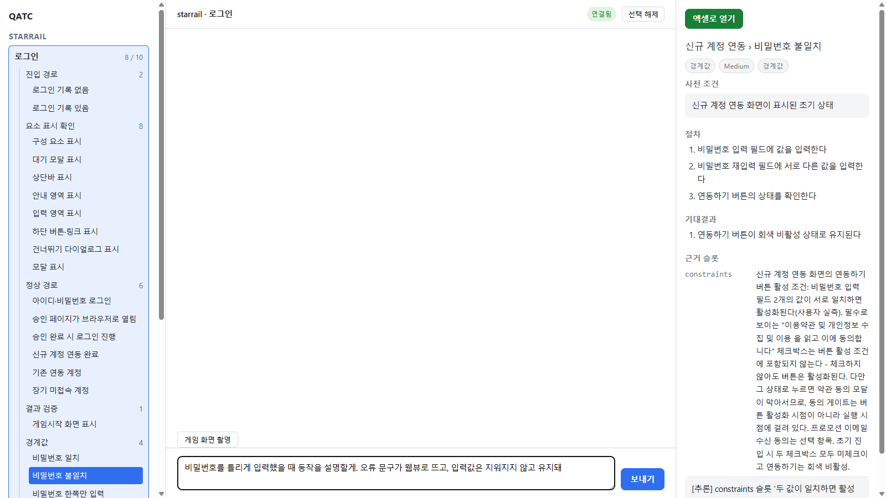
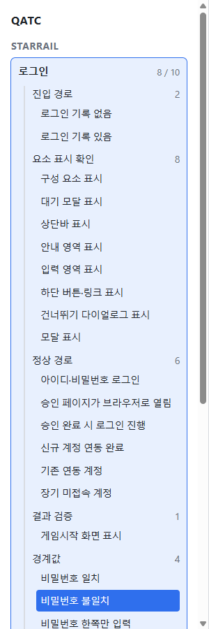
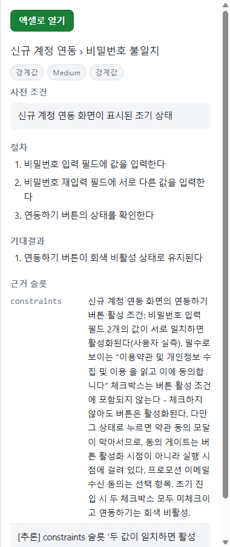

# QATC — 대화로 만드는 게임 QA 테스트케이스

게임 컨텐츠를 채팅으로 설명하면, 도구가 인터뷰로 정보를 끌어내
**근거가 붙은 테스트케이스 엑셀**을 만들어 줍니다.
서브컬쳐 게임(원신, 붕괴: 스타레일, 명조, 블루 아카이브) QA 를 위해 만들었습니다.

Windows · Python 3.11+ · 전부 로컬에서 동작 (외부 서버 없음)



---

## 무엇이 다른가

- **아는 것을 말하면 됩니다.** 명세서를 채우는 대신, 컨텐츠를 아는 사람이
  채팅으로 설명합니다. 도구가 부족한 부분을 되물어서 지식을 슬롯 단위로
  쌓고, 채워진 만큼(`8 / 10`) 진행 상황이 보입니다.
- **근거 없는 TC 는 만들어지지 않습니다.** 모든 테스트케이스는 어느 슬롯의
  어떤 진술에서 나왔는지를 달고 나옵니다. 진술이 바뀌거나 철회되면 그 TC 는
  지워지는 대신 `근거 철회됨` 으로 표시됩니다 — 표를 받은 사람이 어디까지
  믿어도 되는지 알 수 있습니다.
- **표가 곧 문서입니다.** `TC_LOGIN_016` 같은 ID 와
  대분류(컨텐츠) · 중분류(화면) · 소분류(케이스 이름) 계층으로 나와서,
  제목을 따로 읽지 않아도 세 칸을 이으면 어떤 테스트인지 드러납니다.

---

## 3분 시작

```bash
python -m venv .venv
.venv\Scripts\activate
pip install -e .
qatc app
```

`qatc app` 이 로컬 서버를 띄우고 브라우저를 엽니다. 화면은 세 칸입니다 —
**왼쪽** 게임 › 컨텐츠 › 계열 › TC 트리, **가운데** 인터뷰 채팅,
**오른쪽** 선택한 TC 의 상세와 [엑셀로 열기].

첫 컨텐츠는 채팅에 이렇게 시작하면 됩니다:

> 로그인 컨텐츠를 설명할게. 클라이언트를 실행하면 접속 화면이 나오고…

---

## 화면 하나씩 보기

### ① 인터뷰 — 설명하면 슬롯이 채워진다

가운데 채팅에 컨텐츠를 설명하면 진입 경로·화면 구성·정상 동작·실패 동작
같은 **지식 슬롯**이 채워집니다. 모르는 건 "모른다"고 답해도 됩니다 — 그
계열의 TC 가 왜 못 만들어졌는지가 트리에 그대로 표시됩니다
(`막힘 — 사용자가 모른다고 답함`).

스크린샷은 채팅창에 **붙여넣거나 끌어다 놓으면** 첨부되고,
`[게임 화면 촬영]` 버튼은 게임 창을 찾아 한 장 찍어 바로 첨부합니다.

> **개인정보 주의.** 화면에 있는 것이 그대로 전달됩니다. 실제로 첫 사용 때의
> 스크린샷에는 계정 이메일 주소가 찍혀 있었습니다. 계정·실명·결제 정보가
> 보이는 캡처는 보내기 전에 잘라내거나 그 이미지를 빼세요.

### ② 트리 — 만들어진 TC 가 계열별로 정리된다



`진입 경로 2 · 요소 표시 확인 8 · 정상 경로 6 …` — 계열마다 몇 건이
만들어졌는지, 어떤 계열이 왜 막혀 있는지가 한눈에 보입니다.

### ③ TC 검토 — 근거까지 따라가서 확인한다



TC 를 클릭하면 `신규 계정 연동 › 비밀번호 불일치` 처럼 화면 경로가 뜨고,
사전 조건 · 절차 · 기대결과 아래에 **이 TC 의 근거가 된 슬롯 진술**이 그대로
붙습니다. 사용자가 직접 말하지 않은 추론 TC 는 `[추론]` 과 도출 근거가
표시됩니다.

### ④ 엑셀 — 그대로 제출할 수 있는 표

[엑셀로 열기] 를 누르면 xlsx 가 만들어져 바로 열립니다. 실제 산출물의 세 줄:

| TC ID | 대분류 | 중분류 | 소분류 | 절차 | 기대결과 | 우선순위 | 출처 |
|---|---|---|---|---|---|---|---|
| TC_LOGIN_004 | 로그인 | 로그인 창 | 아이디·비밀번호 로그인 | 1. 유효한 계정 입력<br>2. 비밀번호 입력<br>3. 게임시작 | 로그인 시도가 진행된다 / 인증 성공 시 로그인 완료 | High | 인터뷰 |
| TC_LOGIN_016 | 로그인 | 신규 계정 연동 | 비밀번호 불일치 | 1. 비밀번호 입력<br>2. 재입력에 다른 값<br>3. 연동하기 상태 확인 | 연동하기 버튼이 회색 비활성 유지 | Medium | 추론됨 |
| TC_LOGIN_025 | 로그인 | 약관 동의 | 얼럿에서 다시읽기 | 1. 약관 창에서 취소<br>2. 얼럿에서 다시읽기 | 얼럿창만 닫힌다 | Medium | 인터뷰 |

실제 시트에는 사전조건 · 근거 · 근거 상태 열이 더 있습니다. 기대결과가 여러
개면 케이스를 분리하는 것이 원칙이고, 연속 동작만 한 케이스로 합칩니다 —
실패했을 때 원인 지점이 바로 보이게 하기 위해서입니다.

---

## 자주 부딪히는 것

**"게임 창을 찾지 못했습니다"** — 게임이 켜져 있는지 확인하세요. 켜져
있는데도 그러면 `profiles/<게임>.yaml` 의 `window.process` 가 실행 파일
이름과 맞는지 보세요.

**"게임 창이 가려져 있습니다"** — 이 도구는 가려진 채로는 찍지 않습니다
(엉뚱한 화면이 근거로 남는 것을 막기 위해서). 게임 창을 앞으로 꺼내거나
겹치지 않게 놓고 다시 누르세요.

**전체화면(배타 모드)은 캡처되지 않습니다** — 테두리 없는 창 모드로
바꾸거나, `Win+Shift+S` 로 찍어 채팅창에 붙여넣으세요.

**포트가 이미 쓰이고 있으면** 다음 포트로 자동으로 넘어가고, 실제 뜬 주소를
화면에 알려줍니다:

```
$ qatc app --port 8765
포트 8765 은(는) 이미 사용 중입니다 — 8766 번으로 대신 띄웁니다.
브라우저를 엽니다 — http://127.0.0.1:8766
```

---

## 새 게임 등록

`profiles/<게임>.yaml` 파일 하나면 됩니다:

```yaml
name: "붕괴: 스타레일"
window:
  process: StarRail.exe        # 게임 화면 촬영이 찾을 창
```

실행 파일 이름이 바뀌면 이 값만 고치면 되고, 창 제목으로 찾고 싶으면
`window.title_regex` 를 씁니다 (둘 다 있으면 둘 다 맞아야 합니다).

---

## 산출물이 어디에 쌓이는가

지식 DB 와 xlsx 는 `knowledge/` 아래에 게임별로 쌓입니다
(`knowledge/starrail.db`, `knowledge/starrail_로그인_TC.xlsx`).
**이 폴더는 `.gitignore` 에 있습니다** — 담당자의 실제 게임 지식과 산출물이라
저장소에 커밋하지 않습니다. 위치를 바꾸려면 `qatc config` 가 알려주는 설정
파일의 `knowledge_root` 를 고치세요.

---

<details>
<summary><b>명령어 참조 (CLI)</b> — 앱 없이 터미널에서도 전 과정을 할 수 있습니다</summary>

```bash
qatc slot init <컨텐츠> --game starrail --code LOGIN --types 편성   # 지식 슬롯 세트 생성
qatc slot status <컨텐츠> --json                        # 남은 항목 확인
qatc slot set <컨텐츠> <키> --status filled --value "..."  # 슬롯 값 기록
qatc slot set <컨텐츠> <키> --status unknown              # 사용자가 모른다고 답함
qatc slot set <컨텐츠> <키> --status na                   # 이 컨텐츠엔 해당 없음
qatc slot set <컨텐츠> <키> --status empty                # 되돌리기 (다시 물어볼 항목이 된다)
qatc slot add <컨텐츠> <키> --hint "..." --family "..."    # 유형에 없던 슬롯 추가
qatc tc plan <컨텐츠>                                    # 만들 수 있는 TC 계열과 제외된 계열
qatc tc add <컨텐츠> --family "정상 경로" --origin interview --json -  # TC 저장
qatc tc list <컨텐츠>                                    # TC 목록 + 미충족 슬롯 리포트
qatc knowledge --game starrail                          # 게임별 컨텐츠 커버리지
qatc export <컨텐츠>                                     # xlsx 출력
qatc config                                              # 설정·프로파일 확인
qatc config --game starrail                              # 기본 게임 설정 (이후 --game 생략 가능)
qatc app                                                 # 3분할 앱을 브라우저로 띄운다
```

`--game` 은 두 가지 방법으로 생략할 수 있습니다. **읽기 명령**(`slot status`,
`tc plan`, `export` 등)은 컨텐츠 이름이 한 게임에서만 발견되면 알아서 찾습니다.
**생성 명령**(`slot init`, `knowledge`)은 `qatc config --game <게임>` 으로 정해 둔
기본 게임을 씁니다. 여러 게임에 같은 이름의 컨텐츠가 있으면 명시해야 합니다.

오타 난 게임 이름은 거부되며, 잘못된 이름으로 새 DB가 생기지 않습니다. 막는
방식은 명령에 따라 다릅니다 — **생성 명령**은 `profiles/` 의 프로파일과 대조하고,
**읽기 명령**은 대조하지 않는 대신 그 이름의 DB 파일이 없으면 만들지 않고 멈춥니다.
읽기까지 대조하지 않는 이유는, 게임이 `profiles/` 에서 사라졌을 때 그 DB에 쌓인
인터뷰에 접근할 방법이 없어지기 때문입니다.

`profiles/` 에 프로파일이 하나도 없으면 대조를 **건너뜁니다** (경고 한 줄을
남깁니다). 무조건 거부하면 폴더가 비었을 때 모든 게임 이름이 막혀 도구를 쓸 수
없게 되기 때문입니다. `profiles_dir` 설정을 잘못 고치면 이 상태가 되니, 오타를
거부하지 않는다 싶으면 `qatc config` 로 프로파일 목록부터 확인하세요.

`--status empty` 는 사실상 **되돌리기**입니다. 잘못 기록했거나 사용자가 답을
바꾸면 이걸로 슬롯을 다시 열 수 있습니다. 이미 그 근거로 만든 TC는 **지우지
않고** `tc list` 와 xlsx에서 `근거 철회됨` 으로 표시됩니다.

`--code` 는 TC ID(`TC_<코드>_<번호>`, 예: `TC_LOGIN_001`)에 쓸 영문 대문자
약어입니다. 새 컨텐츠에는 사실상 필수입니다 — 코드 없이는 `tc add` 가 첫
TC ID를 만들 때 거부합니다. **한 번 정하면 바꿀 수 없습니다** — 이미 발급된
ID가 그 코드를 가리키기 때문입니다.

</details>

<details>
<summary><b>개발자 정보</b> — 동작 원리와 테스트</summary>

인터뷰로 채워진 슬롯에서만 TC 가 생성됩니다:

```
사용자가 컨텐츠를 설명 → 지식 슬롯 채움 → 계열 게이트 통과 → TC 생성 → xlsx 출력
```

어떤 계열을 만들 수 있는지는 모델이 아니라 `qatc tc plan` 이 슬롯 충족
여부로 판정하고(`qatc/knowledge/gate.py`), 만들 수 없는 계열은 `qatc tc add`
가 거부합니다. 인터뷰 진행 규칙은
[`.claude/skills/interview/SKILL.md`](.claude/skills/interview/SKILL.md),
설계 배경은 [docs/superpowers/specs/](docs/superpowers/specs/) 에 있습니다.

처음에는 플레이 녹화를 분석해 TC 를 뽑는 방식이었지만, 실측에서 검출된 UI
요소 1,358개 중 기능이 밝혀진 것은 8개(0.6%)뿐이었습니다 — 버튼의 기능은
눌러본 것에서만 알 수 있습니다. 그래서 **아는 사람에게 물어보는** 지금
방향으로 바꿨습니다.

앱(`qatc app`)은 지식 DB 에 아무것도 쓰지 않습니다 — 슬롯과 TC 를 바꾸는
유일한 경로는 채팅이 여는 `claude` 세션이고, 이 불변식은 디스크 바이트
검사로 테스트됩니다. 채팅에 첨부한 이미지는 저장소 안 `.qatc-shots/`
(`.gitignore`) 에 임시 저장되어 읽기만 하고 턴이 끝나면 지워집니다.

테스트:

```bash
.venv\Scripts\python.exe -m pytest
```

`.claude/settings.json` 의 Bash allowlist 는 인터뷰 중 매 슬롯 기록마다 권한
승인 창이 뜨지 않게 하는 전제 조건입니다. `sessions/` 는 이전 녹화
파이프라인의 흔적으로 지금은 아무 코드도 읽지 않습니다.

</details>
